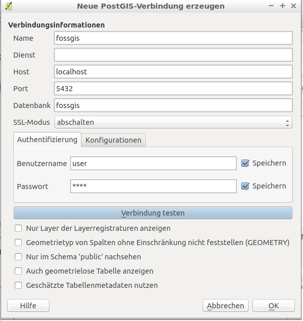
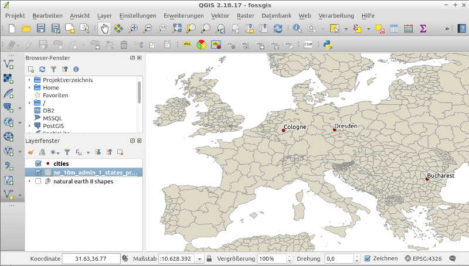
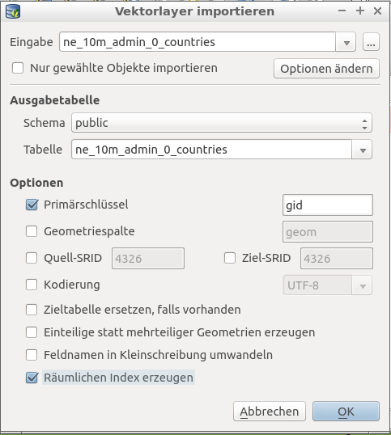
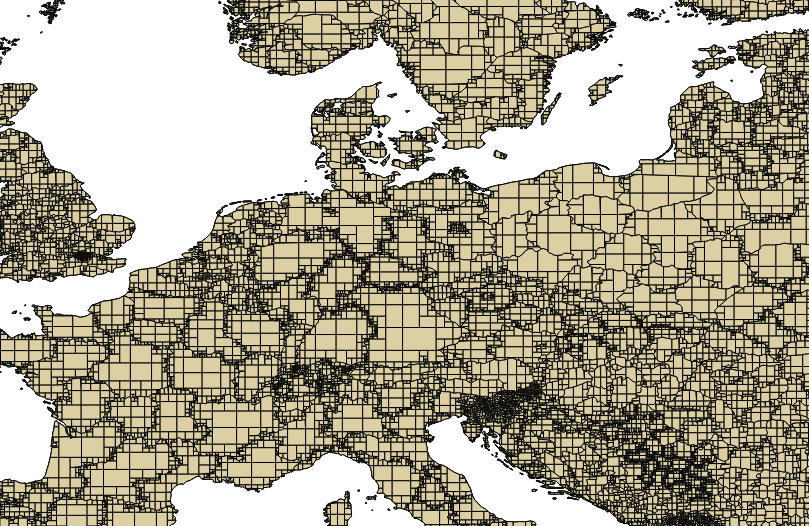

# Workshop PostgreSQL/PostGIS für Einsteiger

[FOSSGIS 2019 Workshop in Dresden 15. März 2019](https://www.fossgis-konferenz.de/2019/)

 


## Astrid Emde

* Astrid Emde
* WhereGroup GmbH & Co. KG 
* astrid.emde@wheregroup.com
* [@astroidex](https://twitter.com/astroidex)


* FOSS Academy https://www.foss-academy.com/


## Die Themen
* Warum lohnt sich der Einsatz einer Datenbank?
* PostgreSQL / PostGIS
* SQL-Einführung
* Import / Export von Daten
* Räumliche Funktionen
* Räumlicher Index
* Rollen & Kontrolle über den Zugriff auf die Daten


## OSGeoLive


Dieser Workshop nutzt OSGeoLive (https://live.osgeo.org) Version 12.0 (Release August 2018). OSGeoLive basiert auf Lubuntu und beinhaltet eine Kollektion aus mehr als 50 vorinstallierten Software-Projekten. OSGeoLive beinhaltet außerdem Beispieldaten, die für diesen Workshop verwendet werden.


OSGeoLive kann über den folgenden Link heruntergeladen werden. Sie können OSGeoLive in einer Virtuellen Maschine (empfohlen) oder über einen USB-Stick nutzen.

* Download OSGeoLive Image http://live.osgeo.org/en/download.html
* Dokumentation https://live.osgeo.org/
* PostGIS Übersicht (OSGeoLive Overview) https://live.osgeo.org/en/overview/postgis_overview.html
* PostGIS Einstieg (OSGeoLive Quickstart) https://live.osgeo.org/en/quickstart/postgis_quickstart.html


## Aktuelle Software Version 

* PostgreSQL 11.2 (2019-02-14) https://www.postgresql.org/
* PostGIS 2.5.1 (2018-11-18) http://www.postgis.org/


### OSGeoLive 12.0 

* PostgreSQL 10.4
* PostGIS 2.4.3

```sql
SELECT version(), postgis_version(), postgis_full_version();
```


## Daten

* Natural Earth II
 * Daten liegen als ESRI Shapedateien vor - Länder, Bundesländer, Flüsse, Orte & mehr unter /home/user/data
 * Datenbank: natural_earth2

## Zusätzliche Information

* PostGIS in Action (August 2015, 2. Auflage) Regine Obe, Leo Hsu ISBN 9781617291395
* Paul Ramsey Blog Clever Elephant http://blog.cleverelephant.ca/
* Clever Elephant ;) https://www.youtube.com/watch?v=Gw_Q1JClH58
* Postgres OnLine Journal Regine Obe, Leo Hsu http://www.postgresonline.com/
* Modern SQL Blog Markus Winand https://modern-sql.com/slides https://use-the-index-luke.com/
* PostgreSQL books https://www.postgresql.org/docs/books/
* pgRouting: A Practical Guide (Mai 2017, 2. Auflage) Regine Obe, Leo Hsu ISBN: 9780989421737
* Information zu Projektionen http://spatialreference.org/


## Warum lohnt sich der Einsatz einer Datenbank?

* zentrale Datenhaltung - keine Datenredundanz
* Konsistenz der Daten
* Mehrbenutzer-Zugriff
* Kontrollierter Zugriff über Zugriffskontrolle und -management
* Zugriff auf die Daten über unterschiedliche Werkzeuge
* Kombination von unterschiedlichen Daten - datenbankweit, datenbankübergreifend und auf Fremdquellen
* SQL zur Generierung und Analyse der Daten
* Backup, Replikation ...
  

## PostgreSQL

* Unterstützt von zahlreichen anderen Programmen
* Schnell, leistungsstark, verlässlich, robust
* Einfach zu Warten
* Folgt SQL Standards
* Schnittstelle zu vielen Programmiersprachen
* Subselects, Funktions, Trigger, Foreign Data Wrapper, Replikation & mehr
* https://www.postgresql.org/about/


## PostGIS

* Erweiterung (Extension) für PostgreSQL
* PostGIS übernimmt die Arbeit, die sonst das DesktopGIS gemacht hat
* Folgt Standards:
 * OGC Simple Feature Spezification for SQL 
 * OGC ISO SQL/MM Spezification 
* Stellt zahlreiche räumliche Funktionen bereit
* Breite Unterstützung durch andere Programme
* Leichter Import / Export von räumlichen Daten (QGIS DB-Verwaltung, shp2pgsql, pgsql2shp, ogr2ogr, dxf2postgis, osm2pgsql)
* Die Vorteile von PostgreSQL können genutzt werden (Benutzerverwaltung, Replication, Indezierung & mehr)
* Sehr leistungsstark: Unterstützung von Vektor- & Rasterdaten, geometry (planar Daten) und geography (spheroid), kreisförmige Objekte, 3D-, 4D-Objekte, Punktwolken, Routing über pg_routing, Topologien
* Daten werden als WKB (Well-known Binary) gespeichert. WKT (Well-known text) zur lesbaren Ausgabe.
* http://www.postgis.org/
* http://postgis.net/docs/manual-2.5/


## Datenbank-Clients

* pgAdmin 4 und pgAdmin III khttps://www.pgadmin.org/
* psql kommandozeilen basierter Client https://www.postgresql.org/docs/current/static/app-psql.html
* QGIS DB-Verwaltung - integriert in QGIS
* und viele mehr


### Übung 1: pgAdmin und erste Schritte im Umgang mit der Datenbank

1. Öffnen Sie pgAdmin über Start -> Geospatial -> Datenbank -> pgAdmin
2. Stellen Sie eine Verbindung zur Datenbank **_natural_earth2_** her
3. Gehen Sie in das Schema **_public_** und schauen Sie sich die Tabellen an
4. Öffnen Sie eine Tabelle und schauen Sie sich die Geometriespalte (geom) an. Können Sie die Geometrie lesen?
5. Öffnen Sie die Tabelle **_spatial_ref_sys_** und filtern Sie nach srid = 4326
7. Gehen Sie zu public -> views (Ansichten) und öffnen Sie die Metadaten-Sicht **_geometry_columns_**


## Wie erfolgt die Kommunikation mit der Datenbank?

* über SQL - Structured Query Language
* DDL - data definition language
* DML - data manipulation language
* DQL - data query language 


### DQL 

* DQL - zur Abfrage von Daten (DQL ist ein Teil der DML) 
z.B. zur Anzeige aller Daten aus der Tabelle **_spatial_ref_sys_**, bei denen srid = 4326 ist.

```sql
SELECT * FROM spatial_ref_sys WHERE srid=4326;
```

### DDL 

* DDL zur Erzeugung von neuen Strukturen wie Datenbanken, Tabellen, Rollen, Schemata & mehr.

```sql
CREATE DATABASE demo;
```

```sql
CREATE TABLE pois(
 gid serial PRIMARY KEY,
 name varchar,
 year int,
 info varchar
);
```

Änderungen der Tabellenstruktur

```sql
ALTER TABLE pois ADD COLUMN land varchar;
ALTER TABLE pois RENAME land TO country;
ALTER TABLE pois DROP COLUMN country;
ALTER TABLE pois ADD CONSTRAINT pk_gid PRIMARY KEY (gid); 
```

Löschen einer Tabelle

```sql
DROP TABLE pois;
```

### DML

* Manipulation von Daten - Erzeugen, Löschen, Verändern von Daten

```sql
INSERT INTO pois (name, year, info) VALUES 
(
'Kölner Dom',
1248,
'https://en.wikipedia.org/wiki/Cologne_Cathedral'
);
```

```sql
DELETE FROM pois WHERE name = 'Kölner Dom';
DELETE FROM pois; -- löscht die gesamten Daten
DELETE FROM pois WHERE gid = 1111;
```

```sql
UPDATE pois SET name = 'Cologne Cathedral' WHERE name = 'Kölner Dom';
```

### Übung 2: Erzeugen einer Datenbank mit PostGIS-Erweiterung

1. Legen Sie eine Datenbank mit dem Namen **_fossgis_** an

Hinweis: Nutzen Sie Kleinbuchstaben und keine Leerzeichen für den Namen von Datenbanken, Tabellen und Spalten! Dies erleichtert den Umgang, da Sie dann keine Anführungszeichen (") nutzen müssen (bei Großschreibweise "FOSSGIS")

2. Verbinden Sie sich mit Ihrer Datenbank

3. Laden Sie die Erweiterung **_postgis_**.

4. Prüfen Sie, ob die PostGIS-Funktionen, die Tabelle **_spatial_ref_sys_** und die Metadaten-Sichten vorliegen


```sql
CREATE DATABASE fossgis;
```

Wechseln zur Datenbank fossgis
```sql
CREATE EXTENSION postgis;
```


### Übung 3: Datenbankhilfsprogramme. Nutzung von createdb zum Anlegen einer Datenbank

* Prüfen Sie das PostGIS-Quickstart und finden Sie heraus, wie die Datenbank **_demo_** angelegt wurde
* https://live.osgeo.org/de/quickstart/postgis_quickstart.html
* PostgreSQL stellt diverse Hilfsprogramme bereit - wie createdb, dropdb, createuser, vacuumdb, pg_dump, pg_restore & mehr. Der Aufruf erfolgt über die Kommandozeile

```sql
createdb -U user -e demo
createdb --help

psql -U user demo
CREATE EXTENSION postgis;
```

### Übung 4: Erzeugen und befüllen Sie die Tabelle cities

* Erzeugen Sie eine neuen Tabelle mit dem Namen **_cities_** mit den Spalten gid, name, country und geom (orientieren Sie sich dazu an dem Beispiel der Tabelle **_pois_**)
* Fügen Sie einen Datensatz für Dresden in die Tabelle mit Hilfe der Funktion ST_MakePoint ein (https://postgis.net/docs/ST_MakePoint.html)
* Sie finden die Koordinate für Dresden unter https://www.latlong.net/place/ 


```sql
CREATE TABLE cities(
 gid serial PRIMARY KEY,
 name varchar,
 country varchar,
 geom geometry(point,4326)
);
```

```sql
INSERT INTO cities(
            name, geom, country)
    VALUES ('Dresden',ST_SetSrid(ST_MakePoint(13.737262, 51.050407),4326),'Germany');
```

```sql
INSERT INTO cities(
            name, geom, country)
    VALUES ('Cologne',ST_SetSRID(ST_MakePoint(6.958307 , 50.941357),4326),'Germany');
```

```sql
INSERT INTO cities(
            name, geom, country)
    VALUES ('Bucharest',ST_SetSRID(ST_MakePoint(26.096306 , 44.439663),4326),'Romania');
```

### Well-Known Text Format (WKT) und Well-Known Binary Format (WKB) 

Die Geometrien werden intern im Well-Known Binary Format (WKB) gespeichert. Eine lesbare Ausgabe ist über das Well-Known Text Format (WKT) möglich.


http://postgis.net/docs/using_postgis_dbmanagement.html#OpenGISWKBWKT


ST_AsEWKT oder ST_AsText zur Anzeige der Geometrie als Text

```sql
SELECT ST_AsText(geom), geom FROM cities; -- mit SRID
SELECT ST_AsEWKT(geom), geom FROM cities; -- ohne SRID
``` 


## QGIS zur Anzeige der Daten

* Sie können Ihre Daten mit QGIS anzeigen, bearbeiten und Daten nach PostgreSQL importieren oder exportieren
* Sie benötigen die Verbindungsparameter für den Zugriff auf die Datenbank - nur berechtigte Benutzer können sich mit den Daten verbinden


 

### Übung 5: QGIS: Anzeige von Daten aus der Datenbank natural_earth2 und fossgis

1. Öffnen Sie QGIS (*Geospatial -> DesktopGIS -> QGIS*) und erstellen Sie ein neues QGIS-Projekt
Laden Sie die Ländergrenzen, Bundesländer, städtische Bereiche (urban areas) und Ortschaften (populated places) aus der Datenbank **_natural_earth2_**
2. Legen Sie eine neue PostGIS-Verbindung für Ihre neue Datenbank **_fossgis_** an
3. Laden Sie die neuen Tabelle **_cities_**
4. Fügen Sie für Ihren Wohnort einen neuen Punkt in Ihre Tabelle **_cities_** ein. Nutzen Sie dazu das QGIS Digitalisierung




## QGIS: Import von Daten nach PostgreSQL über die QGIS DB-Verwaltung

Die QGIS DB-Verwaltung bietet eine komfortable Möglichkeit zum Import und Export von Daten. Sie finden die QGIS DB-Verwaltung im Menü unter *Databanken -> DB-Verwaltung*. Sie benötigen einen Datenbankverbindung für den Zugriff auf die Daten.

Laden Sie die Daten, die Sie laden möchten, am Besten in ein QGIS-Projekt. Die Daten können auch gefiltert werden, so dass Sie auch nur einen Auszug der Daten in die Datenbank laden können.

Der Import erfolgt über die folgenden Schritte:

* Öffnen Sie die QGIS DB-Verwaltung
* Verbinden Sie sich mit Ihrer Datenbank
* Wählen Sie den **Import**-Button
* Wählen Sie die Daten für den Import aus
* Definieren Sie einen Namen für die Tabelle, den EPSG-Code und fügen Sie einen Primärschlüssel hinzu
* Erzeugen Sie einen räumlichen Index
* Starten Sie den Import
* Fügen Sie die Daten nach dem Import per drag & drop in Ihr QGIS-Projekt


 

### Übung 6: Laden von natural_earth2-Shapes in Ihre Datenbank

* Importieren Sie die Datei ne_10m_admin_0_countries.shp in die Tabelle **_ne_10m_admin_0_countries_**
* Importieren Sie die Datei ne_10m_admin_1_states_provinces_shp.shp in die Tabelle **_ne_10m_admin_1_states_provinces_shp_**
* Importieren Sie lediglich die Bundesländer von Deutschland in die Tabelle **_provinces_brd_** (nutzen Sie den Filter admin='Germany')
* Importieren Sie die Shape ne_10m_populated_places.shp in die Tabelle **_ne_10m_populated_places_**
* Schauen Sie sich die Metadaten-Sicht **_geometry_columns_** an


## PostGIS-Funktionen in Aktion

* PostGIS Dokumentation http://postgis.net/docs/
* PostGIS Vector Functions see Chapter 8: http://postgis.net/docs/reference.html
* PostGIS deutschsprachige Dokumentation http://www.postgis.net/docs/postgis-de.html

### ST_AsEWKT oder ST_AsText zur Anzeige der Geometrie als Text

```sql
SELECT ST_AsText(geom) FROM cities; -- mit SRID
SELECT ST_AsEWKT(geom) FROM cities; -- ohne SRID
SELECT ST_AsEWKT(geom) FROM provinces_brd;
``` 

### Funktionen zur Geometriegenerierung (Geometry Constructors)

* Es gibt zahlreiche Funktionen zum Erzeugen von Geometrien 
* siehe Geometry Constructors http://postgis.net/docs/reference.html#Geometry_Constructors
* Wir nutzten ST_MakePoint bereits - diese Funktion unterstützt 2D, 3DZ oder 4D Geometrien http://postgis.net/docs/ST_MakePoint.html

ST_GeomFromText - kann für unterschiedliche Geometrietypen verwendet werden
* http://postgis.net/docs/ST_GeomFromText.html
* http://postgis.net/docs/using_postgis_dbmanagement.html#OpenGISWKBWKT

```sql
Update cities 
 set geom = ST_GeomFromText('POINT(6.958307 50.941357)',4326) 
 WHERE name = 'Cologne';
```

```sql
Update ne_10m_admin_0_countries 
 set geom = ST_GeomFromText('MULTIPOLYGON(((0 0,4 0,4 4,0 4,0 0),(1 1,2 1,2 2,1 2,1 1)), ((-1 -1,-1 -2,-2 -2,-2 -1,-1 -1)))',4326) 
 WHERE name = 'Spain';
```

### Räumliche Beziehungen und Berechnungen

Ausgabe von Informationen über Ihre Daten wie z.B. Distanz, Fläche, Länge, Mittelpunkt.


#### Übung 7: Berechnen Sie die Fläche für jedes Land

* http://postgis.net/docs/ST_Area.html
* Achtung: Beachten Sie, dass zur Berechnung der Fläche die Einheit der verwendeten Projektion genutzt wird (Bei den Natural Earth II Daten ist dies EPSG 4326 also Grad) Verwenden Sie daher für die Berechnung den Spheroid, um sinnvolle Ergebnisse zu erhalten.

Ohne Verwendung des Spheroids (Ausgabe in den Einheiten des EPSG-Codes)
```sql
SELECT gid, name, st_Area(geom)
  FROM public.ne_10m_admin_0_countries;
```

Berechnung mit Spheroid (Ergebnis in Quadratmetern)
```sql
SELECT gid, name, st_Area(geom, true) as flaeche
  FROM public.ne_10m_admin_0_countries;
```
Ausgabe von Deutschland und Rumänien sortiert nach Größe
```sql
SELECT gid, name, st_Area(geom, true) as flaeche
  FROM public.ne_10m_admin_0_countries
  WHERE name IN ('Germany','Romania') 
  ORDER BY flaeche DESC;
```

#### Übung 8: Erzeugen Sie eine Sicht, die den Mittelpunkt jedes Landes ausgibt

* Erzeugen Sie eine Sicht, die den Mittelpunkt jedes Landes ausgibt
* Laden Sie die Daten in QGIS
* Schauen Sie sich die Sicht geometry_columns an. Welcher Geometrietyp und welche Projektion werden angegeben?

```sql
Create view qry_country_centroid AS
SELECT gid, name, st_centroid(geom)
  FROM public.ne_10m_admin_0_countries;
```

Erzeugen Sie die Sicht erneut und weisen dabei der Geometrie den Typ POINT und den EPSG-Code 4326 zu (Stichwort typecast). Schauen Sie sich die Daten in QGIS an. Wo liegt der Mittelpunkt von Frankreich (France)?

```sql
Drop view qry_country_centroid;
Create view qry_country_centroid AS
SELECT gid, name, st_centroid(geom)::geometry(point,4326) as geom
  FROM public.ne_10m_admin_0_countries;
```

Nutzen Sie die Funktion ST_PointOnSurface

```sql
Create view qry_country_pointonsurface AS
SELECT gid, name, st_pointonsurface(geom)::geometry(point,4326) as geom
  FROM public.ne_10m_admin_0_countries;
```

#### Übung 9: Distanzberechnung

* Gehen Sie zurück zur Tabelle **_cities_** aus Übung 4. Berechnen Sie die Entfernung von Ihrem Wohnort nach Dresden.
* Nutzen Sie dabei den Spheroid für die Berechnung (Nutzung des Typs **_geography_**)
* https://postgis.net/docs/ST_Distance.html

```sql
SELECT g.name, myhome.name, ST_Distance(g.geom, myhome.geom, true) 
FROM cities g, 
cities myhome 
WHERE 
g.name = 'Dresden' 
AND myhome.name='Cologne';
```

* Frage: Wer hatte die weiteste und wer die kürzeste Anreise?


### Räumlicher Index und funktionaler Index

* Ihre Geometriespalte sollte einen räumlichen Index aufweisen - dieser beschleunigt räumliche Abfragen
* Der räumliche Index speichert zu jeder Geometrie die BoundingBox

```sql
CREATE INDEX gist_cities_geom
 ON cities 
 USING GIST (geom);
```

* Sie können auch einen funktionalen Index erzeugen z.B. mit ST_Transform

ST_Transform transformiert die Daten in eine andere Projektion.

```sql
CREATE INDEX gist_cities_geom_25832
 ON cities 
 USING GIST (ST_Transform(geom,25832));
```

### Geometrieprozessierung

* Es gibt zahlreiche Funktionen zur Geometrieprozessierung z.B. Puffern, Verschneiden, Vereinigen, Teilen
* http://postgis.net/docs/reference.html#Geometry_Processing


#### Übung 10: Puffern Sie die Tabelle populated places mit 10 km

* Puffern Sie die Tabelle **_ne_10m_populated_places_** mit 10 km
* http://postgis.net/docs/ST_Buffer.html
* Beachten Sie, dass Sie den Typ geography nutzen müssen, um einen Puffer in Metern zu erzeugen (nutzen Sie  typecast ::geography)

```sql
CREATE TABLE places_buffer_10_km as
SELECT 
  gid, 
  name, 
  ST_Buffer(geom::geography, 10000)::geometry(polygon,4326) as geom 
  FROM public.ne_10m_populated_places;
```

```sql
SELECT a.* 
  FROM places_buffer_10_km a, places_buffer_10_km b
  WHERE a.geom && b.geom 
  AND ST_Intersects(a.geom, b.geom) 
  AND a.gid != b.gid;
```

```sql
CREATE INDEX gist_places_buffer_10_km_geom
  ON places_buffer_10_km 
  USING GIST (geom);
```

Führen Sie die Abfrage erneut aus und prüfen Sie, ob der Index verwendet wird.

```sql
SELECT a.* 
  FROM places_buffer_10_km a, places_buffer_10_km b
  WHERE
  ST_Intersects(a.geom, b.geom) 
  AND a.gid != b.gid
```

```sql
EXPLAIN ANALYZE
SELECT a.* 
  FROM places_buffer_10_km a, places_buffer_10_km b
  WHERE
  ST_Intersects(a.geom, b.geom) 
  AND a.gid != b.gid
```

#### Übung 11: ST_UNION - Vereinigen Sie alle Bundesländer von Deutschland zu einer Fläche 

* Erzeugen Sie eine Sicht **_qry_brd_union_**
* Nutzen Sie ST_UNION http://postgis.net/docs/ST_Union.html
* Nutzen Sie die Tabelle **_ne_10m_admin_1_states_provinces_shp_** und filtern Sie nach admin Germany (admin='Germany') 
* Fügen Sie die Spalte **_admin_** in Ihre Sicht ein - Sie müssen GROUP BY verwenden
* Wenden Sie typecast auf die Geometriespalte an
* Schauen Sie sich das Ergebnis in QGIS an

Version 1: Vereinigung der Bundesländer von Germany über ST_UNION
```sql
SELECT ST_UNION(geom)
  FROM public.ne_10m_admin_1_states_provinces_shp 
  WHERE admin='Germany';
```

Version 2: Ausgabe als Text
```sql
SELECT 1 as gid, 
  admin, 
  st_AsText(ST_UNION(geom))
  FROM public.ne_10m_admin_1_states_provinces_shp 
  WHERE admin='Germany'
  GROUP BY admin ;
```

Version 3: Typcast, Benennung der Geometriespalte und zusätzliche Ausgabe der Spalte admin
```sql
CREATE VIEW qry_brd_union AS
SELECT 1 as gid, 
  admin, 
  ST_UNION(geom)::geometry(multipolygon,4326) as geom
  FROM public.ne_10m_admin_1_states_provinces_shp 
  WHERE admin='Germany'
  GROUP BY admin ;
```

### ST_Subdivide

* Unterteilt Multi-/Polygone in viele kleinere Polygone
* Definition der maximalen Stützpunkte (Standardwert ist 256, kann nicht < 8 sein). Die Polygone haben nicht mehr Stützpunkte als max_vertices
* http://postgis.net/docs/manual-2.4/ST_Subdivide.html
* Neu ab PostGIS 2.3.0


 

```sql
CREATE TABLE provinces_subdivided AS 
  SELECT 
  name, 
  admin, 
  st_subdivide(geom) AS geom
  FROM ne_10m_admin_1_states_provinces_shp;

ALTER TABLE provinces_subdivided ADD COLUMN gid serial PRIMARY KEY;
```

* Mit Definition von max_vertices 20

```sql
DROP TABLE provinces_subdivided;
CREATE TABLE provinces_subdivided AS 
  SELECT 
  name, 
  admin, 
  st_subdivide(geom,20) AS geom
  FROM ne_10m_admin_1_states_provinces_shp ;

ALTER TABLE provinces_subdivided ADD COLUMN gid serial PRIMARY KEY;
```


```sql
CREATE INDEX provinces_subdivided_the_geom_gist
  ON provinces_subdivided
  USING gist
  (geom);
```

#### Übung 12: ST_Subdivide

* Manchmal macht es Sinn, große Geometrien für Berechnungen in kleinere Flächen auszuteilen
* Diese Übung soll dies mit Hilfe einer Funktion veranschaulichen
* Erzeugen Sie eine neue Funktion **getCountrynameSubdivided()** für die Tabelle **_provinces_subdivided_**
* Schauen Sie sich EXPLAIN an, um die Performanz zu beurteilen

```sql
CREATE OR REPLACE FUNCTION getCountrynameSubdivided(mygeometry geometry) 
 RETURNS character varying 
 AS 'SELECT c.name FROM provinces_subdivided c 
 WHERE st_intersects(c.geom,$1);' 
LANGUAGE 'sql'; 
```

```sql
SELECT name, getCountrynameSubdivided(geom) 
 FROM public.ne_10m_populated_places 
 WHERE adm0name = 'Germany';
```

```sql
EXPLAIN ANALYZE
SELECT name, getCountrynameSubdivided(geom) 
 FROM public.ne_10m_populated_places 
 WHERE adm0name = 'Germany';
```

```sql
ALTER TABLE ne_10m_populated_places ADD COLUMN countryname varchar;

UPDATE ne_10m_populated_places 
SET countryname = getCountrynameSubdivided(geom);
```

Funktion, die die Originaldaten (Provinzen) nutzt
```sql
CREATE OR REPLACE FUNCTION getCountryname(mygeometry geometry) 
 RETURNS character varying 
 AS 'SELECT c.name FROM ne_10m_admin_1_states_provinces_shp c 
 WHERE st_intersects(c.geom,$1);' 
LANGUAGE 'sql'; 
```

```sql
EXPLAIN ANALYZE
SELECT name, getCountryname(geom) 
 FROM public.ne_10m_populated_places;
```

## PostgreSQL Rollen und Zugriffskontrolle

PostgreSQL unterstützt Rollen (Benutzer mit Login und Rollen ohne Login). Diese Rollen können unterschiedliche Berechtigungen haben und bekommen über GRANT den Zugriff auf die Objekte z.B. Tabellen, Sichten, Schema, Funktionen.

* Siehe CREATE ROLE: https://www.postgresql.org/docs/current/static/sql-createrole.html
* Siehe GRANT https://www.postgresql.org/docs/current/static/sql-grant.html


### Übung 13: Rollen erzeugen und Rechte zuweisen

1. Legen Sie die Rollen **workshop_read** und **workshop_writer** an
2. Legen Sie die Login-Rolle **robert** mit Passwort an und fügen Sie diese zur Gruppe **workshop_reader** hinzu
3. Legen Sie die Login-Rolle **wilma** an und fügen Sie diese zur Gruppe **workshop_writer** hinzu
4. Geben Sie der Gruppe **workshop_reader** Leserechte auf die Tabelle **_ne_10m_admin_1_states_provinces_shp_**
5. Geben Sie der Gruppe **workshop_writer** Schreibrechte auf die Tabelle **_cities_**
6. Testen Sie den lesenden und schreibenden Zugriff über QGIS 

```sql
CREATE ROLE workshop_reader;
CREATE ROLE workshop_writer;

CREATE ROLE robert WITH LOGIN PASSWORD 'fossgis';
GRANT workshop_reader TO robert;

CREATE ROLE wilma WITH LOGIN PASSWORD 'fossgis';
GRANT workshop_writer TO wilma;

GRANT SELECT ON ne_10m_admin_1_states_provinces_shp TO workshop_reader;
-- Wechseln Sie in die Rolle robert
Select * from ne_10m_admin_1_states_provinces_shp;

GRANT ALL ON cities to workshop_writer;
GRANT USAGE ON SEQUENCE cities_gid_seq TO workshop_writer;

-- Wechseln Sie in die Rolle wilma in pgAdmin
-- Führen Sie das folgende SQL aus
SELECT * from cities;
UPDATE cities SET name = 'TEST' WHERE name = 'Bonn';
SELECT * from cities where name = 'TEST';
```


